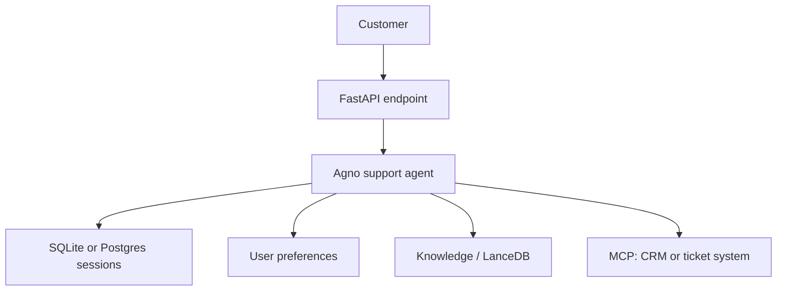

# Capstone: Support Knowledge Assistant

Build this after completing the earlier folders. It is a credible product case study because it combines agent behavior, retrieval, user state and external tools.

## Product problem

A support team needs consistent answers from product documentation while retaining each customer's preferences and each ticket's conversation context.

## Architecture

## Implementation checklist

1. Keep `user_id` from authentication and `session_id` from the ticket/thread.
2. Configure `add_history_to_context=True` with a bounded history.
3. Use memory only for durable preferences—never passwords, API keys, or sensitive payment data.
4. Index approved support documents in `Knowledge` and enable `search_knowledge=True`.
5. Add only least-privilege MCP tools (for example, ticket lookup but not delete).
6. Log tool calls, add guardrails and test retrieval answers before production.

## Interview explanation

"I use a session ID for the current ticket so the agent understands the thread. A user ID scopes durable preferences across tickets. Product facts are not saved as memory—they live in the vector knowledge base and are retrieved for each relevant question. External actions are exposed through tightly scoped MCP tools."
